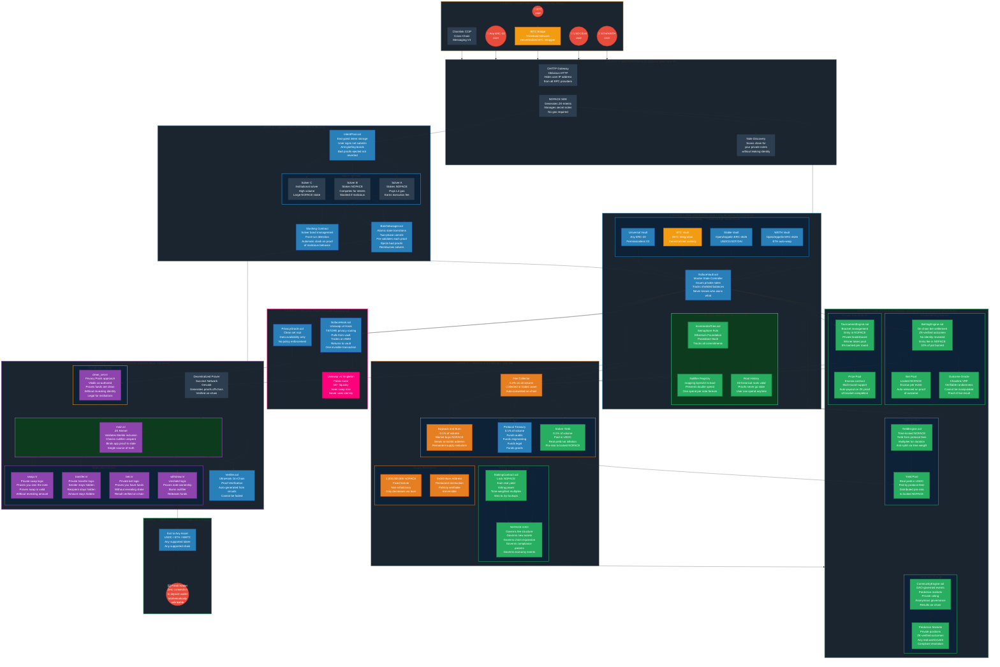

```mermaid


graph TB
    classDef user fill:#e74c3c,stroke:#c0392b,stroke-width:2px,color:#fff
    classDef offchain fill:#2c3e50,stroke:#1a252f,stroke-width:2px,color:#fff
    classDef contract fill:#2980b9,stroke:#1f3a93,stroke-width:2px,color:#fff
    classDef zk fill:#8e44ad,stroke:#5b2c6f,stroke-width:2px,color:#fff
    classDef uni fill:#ff007a,stroke:#c2005d,stroke-width:2px,color:#fff
    classDef economy fill:#27ae60,stroke:#1e8449,stroke-width:2px,color:#fff
    classDef burn fill:#e67e22,stroke:#d35400,stroke-width:2px,color:#fff
    classDef btc fill:#f39c12,stroke:#e67e22,stroke-width:2px,color:#fff
    classDef done fill:#27ae60,stroke:#1e8449,stroke-width:3px,color:#fff

    %% ════════════════════════════════════════
    %% ENTRY LAYER
    %% ════════════════════════════════════════

    subgraph Entry["LAYER 0 — ASSET ENTRY (Any Asset, Any Chain)"]
        direction LR
        UserETH(("👤 ETH/WETH\nUser")):::user
        UserUSDC(("👤 USDC/DAI\nUser")):::user
        UserBTC(("👤 BTC\nUser")):::user
        UserOther(("👤 Any ERC-20\nUser")):::user

        BTC_Bridge["tBTC Bridge\nThreshold Network\nDecentralized BTC Wrapper"]:::btc
        CCIP["Chainlink CCIP\nCross-Chain\nMessaging V3"]:::offchain
    end

    %% ════════════════════════════════════════
    %% METADATA PRIVACY
    %% ════════════════════════════════════════

    subgraph Meta["LAYER 1 — METADATA SHIELD (Nobody Sees Your IP)"]
        direction LR
        OHTTP["OHTTP Gateway\nOblivious HTTP\nHides user IP address\nfrom all RPC providers"]:::offchain
        SDK["NOFACE SDK\nGenerates ZK-Intents\nManages secret notes\nNo gas required"]:::offchain
        NoteDisc["Note Discovery\nScans chain for\nyour private notes\nwithout leaking identity"]:::offchain
    end

    %% ════════════════════════════════════════
    %% THE VAULT LAYER
    %% ════════════════════════════════════════

    subgraph Vault["LAYER 2 — THE UNIVERSAL VAULT (Hardened Smart Contracts)"]
        direction TB

        subgraph AssetVaults["Asset Custody — Forked Battle-Tested Code"]
            ETH_Vault["WETH Vault\nOpenZeppelin ERC-4626\nETH auto-wrap"]:::contract
            USDC_Vault["Stable Vault\nOpenZeppelin ERC-4626\nUSDC/USDT/DAI"]:::contract
            BTC_Vault["BTC Vault\ntBTC Integration\nDecentralized custody"]:::btc
            ERC20_Vault["Universal Vault\nAny ERC-20\nPermissionless V2"]:::contract
        end

        NofaceVault["NofaceVault.sol\nMaster State Controller\nIssues private notes\nTracks shielded balances\nNever knows who owns what"]:::contract

        subgraph TreeLayer["Cryptographic Memory — BUILT TODAY ✅"]
            Tree["IncrementalTree.sol\nSemaphore Fork\nEthereum Foundation\nPoseidon2 Hash\nTracks all commitments"]:::done
            Nullifiers["Nullifier Registry\nmapping bytes32 to bool\nPrevents double spend\nOne spend per note forever"]:::done
            RootHistory["Root History\nAll historical roots valid\nProofs never go stale\nUser can spend anytime"]:::done
        end
    end

    %% ════════════════════════════════════════
    %% ZK PROOF LAYER
    %% ════════════════════════════════════════

    subgraph ZK["LAYER 3 — ZERO KNOWLEDGE ENGINE (Noir / UltraHonk)"]
        direction TB

        subgraph Kernel["The State Kernel"]
            MainNR["main.nr\nZK Kernel\nValidates Merkle inclusion\nChecks nullifier unspent\nBinds app proof to state\nSingle source of truth"]:::zk
        end

        subgraph AppCircuits["Application Circuits"]
            SwapNR["swap.nr\nPrivate swap logic\nProves you own the note\nProves swap is valid\nWithout revealing amount"]:::zk
            TransferNR["transfer.nr\nPrivate transfer logic\nSender stays hidden\nRecipient stays hidden\nAmount stays hidden"]:::zk
            BetNR["bet.nr\nPrivate bet logic\nProves you have funds\nWithout revealing stake\nResult verified on-chain"]:::zk
            WithdrawNR["withdraw.nr\nUnshield logic\nProves note ownership\nBurns nullifier\nReleases funds"]:::zk
        end

        subgraph Compliance["Compliance Circuit"]
            CleanSet["clean_set.nr\nPrivacy Pools approach\nVitalik co-authored\nProves funds are clean\nWithout revealing identity\nLegal for institutions"]:::zk
        end

        Verifier["Verifier.sol\nUltraHonk On-Chain\nProof Verification\nAuto-generated from circuits\nCannot be fooled"]:::contract
        Prover["Decentralized Prover\nSuccinct Network\nGevulot\nGenerates proofs off-chain\nVerified on-chain"]:::offchain
    end

    %% ════════════════════════════════════════
    %% INTENT AND SOLVER LAYER
    %% ════════════════════════════════════════

    subgraph IntentLayer["LAYER 4 — INTENT ENGINE (Gasless Execution)"]
        direction TB

        IntentPool["IntentPool.sol\nEncrypted intent storage\nUser signs not submits\nAnti-griefing bonds\nBad proofs ejected not reverted"]:::contract

        subgraph SolverNet["Solver Network"]
            Solver1["Solver A\nStakes NOFACE\nPays L2 gas\nEarns execution fee"]:::offchain
            Solver2["Solver B\nStakes NOFACE\nCompetes for intents\nSlashed if malicious"]:::offchain
            Solver3["Solver C\nInstitutional solver\nHigh volume\nLarge NOFACE stake"]:::offchain
        end

        Slashing["Slashing Contract\nSolver bond management\nFront-run detection\nAutomatic slash on proof\nof malicious behavior"]:::contract

        BatchManager["BatchManager.sol\nAtomic state transitions\nTwo-phase commit\nPre-validates each proof\nEjects bad proofs\nReimburses solvers"]:::contract
    end

    %% ════════════════════════════════════════
    %% SWAP LAYER
    %% ════════════════════════════════════════

    subgraph SwapLayer["LAYER 5 — PRIVATE SWAP ENGINE (Uniswap v4)"]
        direction LR
        Hook["NofaceHook.sol\nUniswap v4 Hook\nTSTORE privacy routing\nPulls from vault\nTrades on AMM\nReturns to vault\nOne invisible transaction"]:::contract
        Oracle["PrivacyOracle.sol\nClean set root\nData availability only\nNo policy enforcement"]:::contract
        UniV4["Uniswap v4 Singleton\nPublic AMM\n5B+ liquidity\nSees swap size\nNever sees identity"]:::uni
    end

    %% ════════════════════════════════════════
    %% PRIVATE ECONOMY LAYER
    %% ════════════════════════════════════════

    subgraph Economy["LAYER 6 — THE PRIVATE ECONOMY (Everything Denominated in $NOFACE)"]
        direction TB

        subgraph Betting["Private Betting Markets"]
            BetEngine["BettingEngine.sol\nOn-chain bet settlement\nZK-verified outcomes\nNo identity revealed\nEntry fee in NOFACE\n10% of pot burned"]:::economy
            BetPool["Bet Pool\nLocked NOFACE\nEscrow per event\nAuto-released on proof\nof outcome"]:::economy
            BetOracle["Outcome Oracle\nChainlink VRF\nVerifiable randomness\nCannot be manipulated\nProof of fair result"]:::economy
        end

        subgraph Tournaments["Private Tournaments"]
            TournEngine["TournamentEngine.sol\nBracket management\nEntry in NOFACE\nPrivate leaderboard\nWinner takes pool\n5% burned per round"]:::economy
            TournPool["Prize Pool\nEscrow contract\nMulti-round support\nAuto-payout on ZK proof\nof bracket completion"]:::economy
        end

        subgraph YieldGames["Yield Events"]
            YieldEngine["YieldEngine.sol\nTime-locked NOFACE\nYield from protocol fees\nMultiplier for duration\nAnti-sybil via time weight"]:::economy
            YieldPool["Yield Pool\nReal yield in USDC\nFed by protocol fees\nDistributed pro-rata\nto locked NOFACE"]:::economy
        end

        subgraph Community["Community Events"]
            CommunityEngine["CommunityEngine.sol\nDAO-governed events\nPrediction markets\nPrivate voting\nAnonymous governance\nResults on-chain"]:::economy
            PredMarket["Prediction Markets\nPrivate positions\nZK-verified outcomes\nAny real world event\nCompliant resolution"]:::economy
        end
    end

    %% ════════════════════════════════════════
    %% TOKEN ECONOMICS
    %% ════════════════════════════════════════

    subgraph TokenEcon["LAYER 7 — $NOFACE ECONOMIC ENGINE"]
        direction TB

        FeeCollector["Fee Collector\n0.3% on all volume\nCollected in traded asset\nAuto-converted on-chain"]:::burn

        subgraph FeeDistribution["Fee Distribution"]
            StakerYield["Staker Yield\n0.1% of volume\nPaid in USDC\nReal yield not inflation\nPro-rata to locked NOFACE"]:::economy
            BuyBurn["Buyback and Burn\n0.1% of volume\nMarket buys NOFACE\nSends to 0x000 address\nPermanent supply reduction"]:::burn
            Treasury["Protocol Treasury\n0.1% of volume\nFunds audits\nFunds engineering\nFunds legal\nFunds grants"]:::contract
        end

        subgraph Staking["Staking and Governance"]
            StakeContract["StakingContract.sol\nLock NOFACE\nEarn real yield\nVoting power\nTime-weighted multiplier\n6mo to 2yr lockups"]:::economy
            DAO["NOFACE DAO\nGoverns fee structure\nGoverns new assets\nGoverns chain expansion\nGoverns compliance params\nGoverns economy events"]:::economy
        end

        subgraph Supply["Supply Mechanics"]
            TotalSupply["1,000,000,000 NOFACE\nFixed forever\nNon-inflationary\nOnly decreases via burn"]:::burn
            BurnAddress["0x000 Burn Address\nPermanent destruction\nPublicly verifiable\nIrreversible"]:::burn
        end
    end

    %% ════════════════════════════════════════
    %% EXIT LAYER
    %% ════════════════════════════════════════

    subgraph Exit["LAYER 8 — ASSET EXIT (Fresh Wallet, Zero History)"]
        direction LR
        FreshWallet(("🆕 Fresh Wallet\nZero connection\nto deposit wallet\nMathematically\nunlinkable")):::user
        ExitAny["Exit to Any Asset\nUSDC / ETH / WBTC\nAny supported token\nAny supported chain"]:::contract
    end

    %% ════════════════════════════════════════
    %% CONNECTIONS
    %% ════════════════════════════════════════

    %% Entry flows
    UserETH --> Meta
    UserUSDC --> Meta
    UserBTC --> BTC_Bridge --> Meta
    UserOther --> Meta
    CCIP --> Meta

    %% Metadata layer
    OHTTP --> SDK
    SDK --> NoteDisc
    SDK --> IntentPool

    %% Vault entry
    SDK --> NofaceVault
    ETH_Vault & USDC_Vault & BTC_Vault & ERC20_Vault --> NofaceVault
    NofaceVault --> Tree
    Tree --> Nullifiers
    Tree --> RootHistory

    %% ZK flows
    NofaceVault --> Prover
    Prover --> MainNR
    MainNR --> SwapNR & TransferNR & BetNR & WithdrawNR
    CleanSet --> MainNR
    Oracle --> CleanSet
    MainNR --> Verifier
    Verifier --> BatchManager

    %% Intent flows
    IntentPool --> Solver1 & Solver2 & Solver3
    Solver1 & Solver2 & Solver3 --> BatchManager
    Solver1 & Solver2 & Solver3 --> Slashing
    BatchManager --> NofaceVault

    %% Swap flows
    NofaceVault --> Hook
    Hook --> UniV4
    UniV4 --> Hook
    Hook --> NofaceVault

    %% Economy flows
    NofaceVault --> BetEngine
    NofaceVault --> TournEngine
    NofaceVault --> YieldEngine
    NofaceVault --> CommunityEngine
    BetEngine --> BetPool
    BetEngine --> BetOracle
    TournEngine --> TournPool
    YieldEngine --> YieldPool
    CommunityEngine --> PredMarket

    %% Fee flows
    NofaceVault --> FeeCollector
    BetEngine --> FeeCollector
    TournEngine --> FeeCollector
    FeeCollector --> StakerYield & BuyBurn & Treasury
    StakerYield --> YieldPool
    BuyBurn --> BurnAddress
    Treasury --> DAO

    %% Staking flows
    StakerYield --> StakeContract
    StakeContract --> DAO
    DAO --> Economy

    %% Exit flows
    WithdrawNR --> ExitAny
    ExitAny --> FreshWallet

    %% Subgraph styles
    style Entry fill:#1a252f,stroke:#f39c12,stroke-width:2px
    style Meta fill:#1a252f,stroke:#2c3e50,stroke-width:2px
    style Vault fill:#1a252f,stroke:#2980b9,stroke-width:2px
    style ZK fill:#1a252f,stroke:#8e44ad,stroke-width:2px
    style IntentLayer fill:#1a252f,stroke:#3498db,stroke-width:2px
    style SwapLayer fill:#1a252f,stroke:#ff007a,stroke-width:2px
    style Economy fill:#1a252f,stroke:#27ae60,stroke-width:2px
    style TokenEcon fill:#1a252f,stroke:#e67e22,stroke-width:2px
    style Exit fill:#1a252f,stroke:#27ae60,stroke-width:2px
    style TreeLayer fill:#0d3b1e,stroke:#27ae60,stroke-width:3px
    style Betting fill:#0d2137,stroke:#27ae60,stroke-width:2px
    style Tournaments fill:#0d2137,stroke:#27ae60,stroke-width:2px
    style YieldGames fill:#0d2137,stroke:#27ae60,stroke-width:2px
    style Community fill:#0d2137,stroke:#27ae60,stroke-width:2px
    style AssetVaults fill:#0d2137,stroke:#2980b9,stroke-width:2px
    style SolverNet fill:#0d2137,stroke:#3498db,stroke-width:2px
    style FeeDistribution fill:#0d2137,stroke:#e67e22,stroke-width:2px
    style Staking fill:#0d2137,stroke:#27ae60,stroke-width:2px
    style Supply fill:#0d2137,stroke:#e67e22,stroke-width:2px
    style AppCircuits fill:#0d2137,stroke:#8e44ad,stroke-width:2px
    style Kernel fill:#0d3b1e,stroke:#8e44ad,stroke-width:3px
    style Compliance fill:#0d2137,stroke:#f39c12,stroke-width:2px

```
