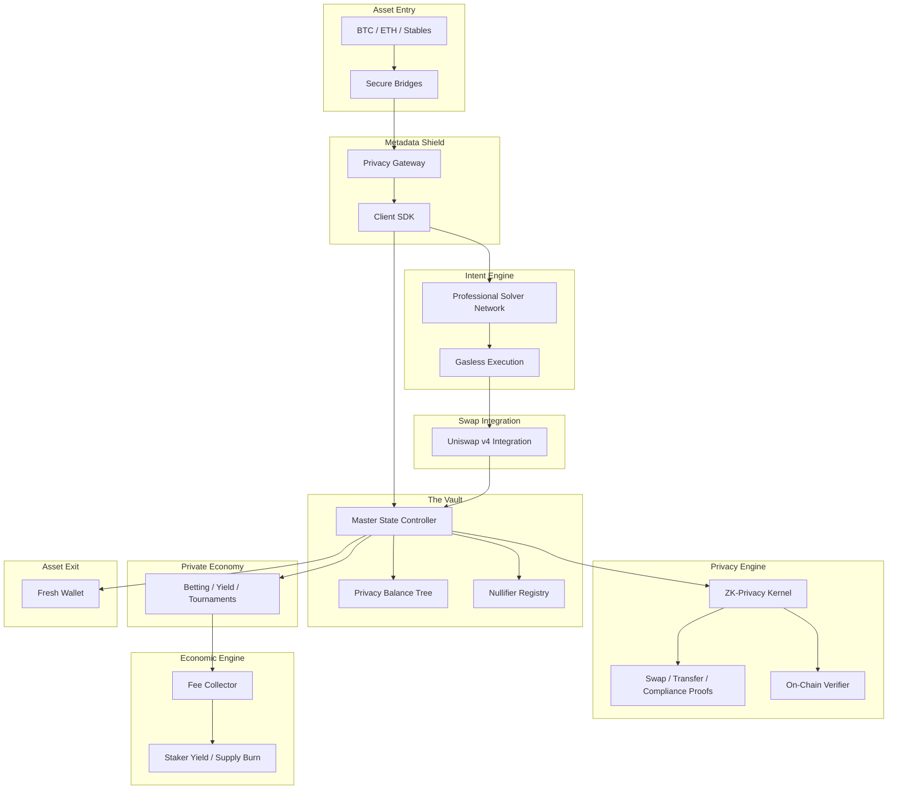

```mermaid
graph TB
    subgraph L0 [Asset Entry]
        direction LR
        Assets[BTC / ETH / Stables] --> Bridge[Secure Bridges]
    end

    subgraph L1 [Metadata Shield]
        Bridge --> Gateway[Privacy Gateway]
        Gateway --> SDK[Client SDK]
    end

    subgraph L2 [The Vault]
        SDK --> MasterVault[Master State Controller]
        MasterVault --> Tree[Privacy Balance Tree]
        MasterVault --> Registry[Nullifier Registry]
    end

    subgraph L3 [Privacy Engine]
        MasterVault --> Kernel[ZK-Privacy Kernel]
        Kernel --> Proofs[Swap / Transfer / Compliance Proofs]
        Kernel --> Verifier[On-Chain Verifier]
    end

    subgraph L4 [Intent Engine]
        SDK --> Solvers[Professional Solver Network]
        Solvers --> Execution[Gasless Execution]
    end

    subgraph L5 [Swap Integration]
        Execution --> UniV4[Uniswap v4 Integration]
        UniV4 --> MasterVault
    end

    subgraph L6 [Private Economy]
        MasterVault --> Economy[Betting / Yield / Tournaments]
    end

    subgraph L7 [Economic Engine]
        Economy --> Fees[Fee Collector]
        Fees --> Rewards[Staker Yield / Supply Burn]
    end

    subgraph L8 [Asset Exit]
        MasterVault --> Exit[Fresh Wallet]
    end
```

