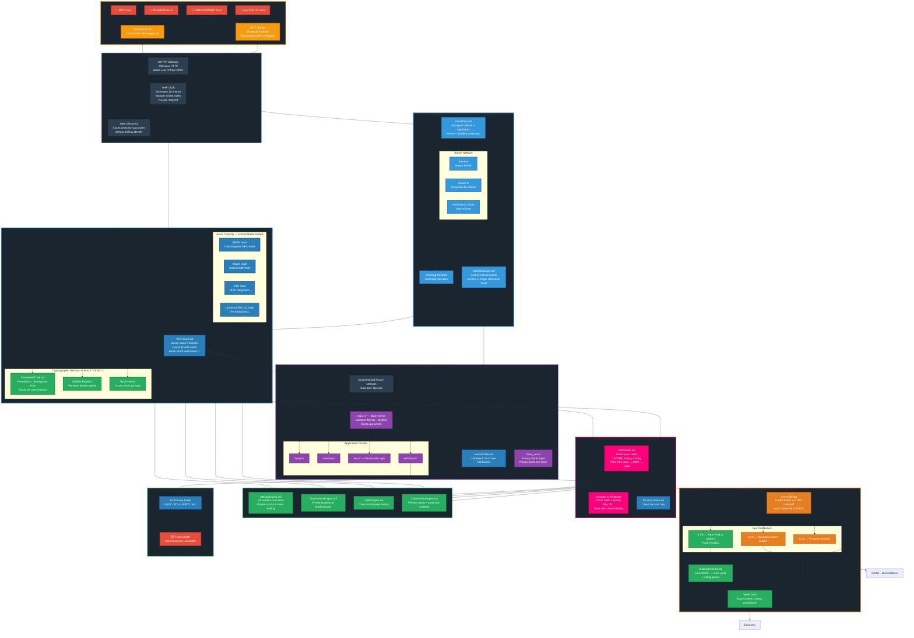

```mermaid
graph TB
    classDef user fill:#e74c3c,stroke:#c0392b,stroke-width:2px,color:#fff
    classDef entry fill:#f39c12,stroke:#d35400,stroke-width:2px,color:#fff
    classDef meta fill:#2c3e50,stroke:#1a252f,stroke-width:2px,color:#fff
    classDef vault fill:#2980b9,stroke:#1f3a93,stroke-width:2px,color:#fff
    classDef zk fill:#8e44ad,stroke:#5b2c6f,stroke-width:2px,color:#fff
    classDef intent fill:#3498db,stroke:#1e5aa8,stroke-width:2px,color:#fff
    classDef hook fill:#ff007a,stroke:#c2005d,stroke-width:2px,color:#fff
    classDef economy fill:#27ae60,stroke:#1e8449,stroke-width:2px,color:#fff
    classDef token fill:#e67e22,stroke:#d35400,stroke-width:2px,color:#fff
    classDef exit fill:#27ae60,stroke:#1e8449,stroke-width:2px,color:#fff
    classDef done fill:#27ae60,stroke:#1e8449,stroke-width:3px,color:#fff

    %% ==================== LAYER 0 - ASSET ENTRY ====================
    subgraph L0 ["LAYER 0 — ASSET ENTRY (Any Asset, Any Chain)"]
        direction LR
        UserBTC["👤 BTC User"]:::user
        UserETH["👤 ETH/WETH User"]:::user
        UserStable["👤 USDC/DAI/USDT User"]:::user
        UserERC20["👤 Any ERC-20 User"]:::user

        tBTC["tBTC Bridge<br>Threshold Network<br>Decentralized BTC Wrapper"]:::entry
        CCIP["Chainlink CCIP<br>Cross-Chain Messaging V3"]:::entry
    end

    %% ==================== LAYER 1 - METADATA SHIELD ====================
    subgraph L1 ["LAYER 1 — METADATA SHIELD (Nobody Sees Your IP)"]
        OHTTP["OHTTP Gateway<br>Oblivious HTTP<br>Hides user IP from RPCs"]:::meta
        SDK["VeilFi SDK<br>Generates ZK-Intents<br>Manges secret notes<br>No gas required"]:::meta
        NoteDisc["Note Discovery<br>Scans chain for your notes<br>without leaking identity"]:::meta
    end

    %% ==================== LAYER 2 - UNIVERSAL VAULT ====================
    subgraph L2 ["LAYER 2 — THE UNIVERSAL VAULT"]
        direction TB
        subgraph AssetVaults ["Asset Custody — Forked Battle-Tested"]
            WETHVault["WETH Vault<br>OpenZeppelin ERC-4626"]:::vault
            StableVault["Stable Vault<br>USDC/USDT/DAI"]:::vault
            BTCVault["BTC Vault<br>tBTC Integration"]:::vault
            ERC20Vault["Universal ERC-20 Vault<br>Permissionless"]:::vault
        end

        VeilFiVault["VeilFiVault.sol<br>Master State Controller<br>Issues private notes<br>Batch Proof Verification ✅"]:::vault

        subgraph CryptoMemory ["Cryptographic Memory — BUILT TODAY ✅"]
            Tree["IncrementalTree.sol<br>Poseidon2 + Semaphore Fork<br>Tracks all commitments"]:::done
            Nullifiers["Nullifier Registry<br>Prevents double-spend"]:::done
            RootHistory["Root History<br>Proofs never go stale"]:::done
        end
    end

    %% ==================== LAYER 3 - ZK ENGINE ====================
    subgraph L3 ["LAYER 3 — ZERO KNOWLEDGE ENGINE (Noir / UltraHonk)"]
        Kernel["main.nr — State Kernel<br>Validates Merkle + Nullifier<br>Binds app proofs"]:::zk
        subgraph AppCircuits ["Application Circuits"]
            SwapNR["swap.nr"]:::zk
            TransferNR["transfer.nr"]:::zk
            BetNR["bet.nr — Private Bet Logic"]:::zk
            WithdrawNR["withdraw.nr"]:::zk
        end
        CleanSet["clean_set.nr<br>Privacy Pools Style<br>Proves funds are clean"]:::zk
        Verifier["HonkVerifier.sol<br>UltraHonk On-Chain Verification"]:::vault
        Prover["Decentralized Prover Network<br>Succinct / Gevulot"]:::meta
    end

    %% ==================== LAYER 4 - INTENT ENGINE ====================
    subgraph L4 ["LAYER 4 — INTENT ENGINE (Gasless Execution)"]
        IntentPool["IntentPool.sol<br>Encrypted intents + signatures<br>Nonce + deadline protection"]:::intent
        subgraph Solvers ["Solver Network"]
            SolverA["Solver A<br>Stakes $VeilFi"]:::intent
            SolverB["Solver B<br>Competes for intents"]:::intent
            SolverC["Institutional Solver<br>High volume"]:::intent
        end
        Slashing["Slashing Contract<br>Automatic penalties"]:::intent
        BatchManager["BatchManager.sol<br>Atomic intents bundle<br>Verified in single UltraHonk Proof"]:::intent
    end

    %% ==================== LAYER 5 - PRIVATE SWAP ENGINE ====================
    subgraph L5 ["LAYER 5 — PRIVATE SWAP ENGINE (Uniswap v4)"]
        Hook["VeilFiHook.sol<br>Uniswap v4 Hook<br>TSTORE privacy routing<br>Pulls from vault → AMM → vault"]:::hook
        UniV4["Uniswap v4 Singleton<br>Public AMM Liquidity<br>5B+ TVL<br>Sees size, never identity"]:::hook
        PrivacyOracle["PrivacyOracle.sol<br>Clean Set root only"]:::vault
    end

    %% ==================== LAYER 6 - PRIVATE ECONOMY ====================
    subgraph L6 ["LAYER 6 — THE PRIVATE ECONOMY"]
        direction TB
        BettingEngine["BettingEngine.sol<br>ZK-verified outcomes<br>Private sports & event betting"]:::economy
        TournEngine["TournamentEngine.sol<br>Private brackets & leaderboards"]:::economy
        YieldEngine["YieldEngine.sol<br>Time-locked yield events"]:::economy
        CommunityEngine["CommunityEngine.sol<br>Private voting + prediction markets"]:::economy
    end

    %% ==================== LAYER 7 - TOKEN ECONOMICS ====================
    subgraph L7 ["LAYER 7 — $VeilFi ECONOMIC ENGINE"]
        FeeCollector["Fee Collector<br>0.20% Shield + 0.10% Unshield<br>Auto-converted to USDC"]:::token

        subgraph FeeSplit ["Fee Distribution"]
            StakerYield["0.1% → Real Yield to Stakers<br>Paid in USDC"]:::economy
            BuyBurn["0.1% → Buyback & Burn $VeilFi"]:::token
            Treasury["0.1% → Protocol Treasury"]:::token
        end

        Staking["StakingContract.sol<br>Lock $VeilFi → Earn yield + voting power"]:::economy
        DAO["VeilFi DAO<br>Governs fees, assets, compliance"]:::economy
    end

    %% ==================== LAYER 8 - ASSET EXIT ====================
    subgraph L8 ["LAYER 8 — ASSET EXIT (Fresh Wallet, Zero History)"]
        FreshWallet["🆕 Fresh Wallet<br>Mathematically unlinkable"]:::user
        ExitAny["Exit to Any Asset<br>USDC / ETH / WBTC / etc."]:::vault
    end

    %% ==================== CONNECTIONS ====================
    %% Entry
    UserBTC & UserETH & UserStable & UserERC20 --> CCIP & tBTC
    CCIP & tBTC --> OHTTP

    %% Metadata
    OHTTP --> SDK
    SDK --> IntentPool
    SDK --> NoteDisc

    %% Vault
    AssetVaults --> VeilFiVault
    SDK --> VeilFiVault
    VeilFiVault --> Tree & Nullifiers & RootHistory

    %% ZK
    VeilFiVault --> Prover
    Prover --> Kernel
    Kernel --> SwapNR & TransferNR & BetNR & WithdrawNR & CleanSet
    CleanSet --> PrivacyOracle
    Kernel --> Verifier
    Verifier --> BatchManager

    %% Intent
    IntentPool --> Solvers
    Solvers --> Slashing & BatchManager
    BatchManager --> VeilFiVault

    %% Swap / Hook
    VeilFiVault --> Hook
    Hook --> UniV4
    UniV4 --> Hook
    Hook --> VeilFiVault
    Hook --> FeeCollector

    %% Private Economy
    VeilFiVault & Hook --> BettingEngine & TournEngine & YieldEngine & CommunityEngine

    %% Token Economics
    FeeCollector --> StakerYield & BuyBurn & Treasury
    StakerYield --> Staking
    BuyBurn --> BurnAddress["0x000... Burn Address"]
    Staking --> DAO
    DAO --> Economy & FeeCollector

    %% Exit
    WithdrawNR --> ExitAny
    ExitAny --> FreshWallet

    %% Styling
    style L0 fill:#1a252f,stroke:#f39c12,stroke-width:3px
    style L1 fill:#1a252f,stroke:#2c3e50,stroke-width:3px
    style L2 fill:#1a252f,stroke:#2980b9,stroke-width:3px
    style L3 fill:#1a252f,stroke:#8e44ad,stroke-width:3px
    style L4 fill:#1a252f,stroke:#3498db,stroke-width:3px
    style L5 fill:#1a252f,stroke:#ff007a,stroke-width:3px
    style L6 fill:#1a252f,stroke:#27ae60,stroke-width:3px
    style L7 fill:#1a252f,stroke:#e67e22,stroke-width:3px
    style L8 fill:#1a252f,stroke:#27ae60,stroke-width:3px
```
