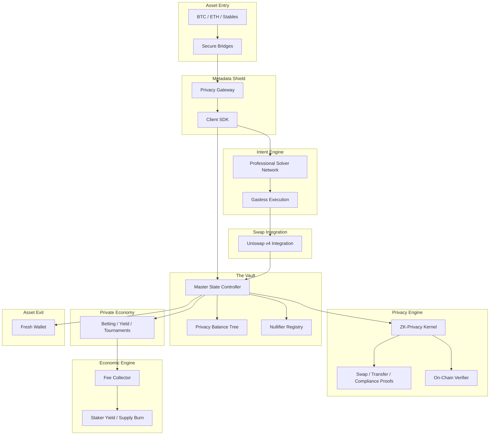

# Protocol Architecture: The Privacy Kernel

This document describes the structural layers of the protocol, focusing on security and information flow.

## 1. Structural Overview

The protocol is organized into eight distinct layers to ensure total anonymity and high performance.

## 2. Layer Deep-Dive

### The Privacy Balance Tree
All private notes are tracked in a fixed-depth tree. When a user deposits, a new "leaf" is added. When a user withdraws, they prove knowledge of a leaf's secret without revealing which leaf it is.

### The ZK-Privacy Kernel
The kernel is the "brain" of the protocol. It is a Zero-Knowledge circuit that validates every transaction. It ensures that the input assets exist, the output assets are correctly formed, and the user has the right to spend them.

### Gasless Intent Execution
To prevent IP-leakage and simplify the user experience, users do not send transactions directly. They sign "Intents" which are picked up by a decentralized network of Solvers. Solvers pay the gas and settle the trade, taking a small fee from the user's shielded balance.

### Compliance Layer (Clean Set)
The protocol includes a built-in compliance mechanism. Users can prove that their funds are part of a "Clean Set" of deposits that have been verified to originate from safe, non-sanctioned addresses. This allows for institutional-grade privacy.
