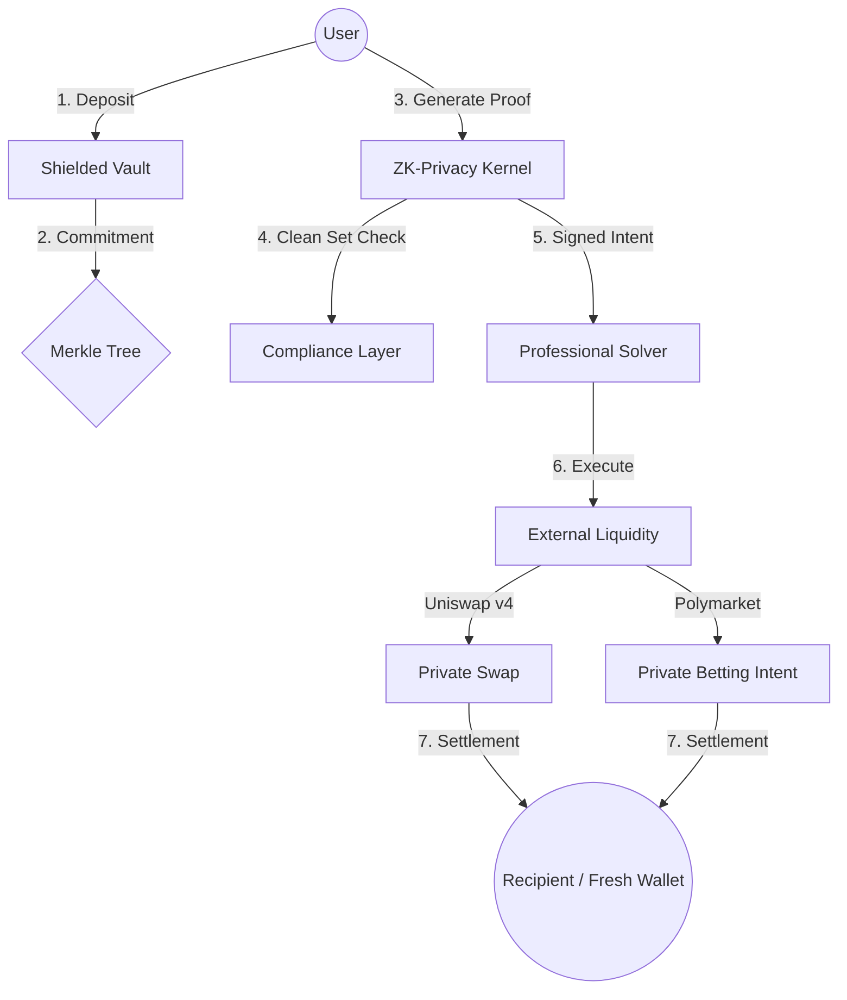

# Protocol Information Flow & Liquidity Graph

This document outlines the high-level architecture of the privacy kernel and its integration with external liquidity sources like Uniswap v4 and Polymarket.

## 1. The Information Flow

The graph below shows how a user interacts with the protocol while maintaining total anonymity.

## 2. Component Breakdown

### A. The Compliance Layer (Clean Set)
Before any assets are swapped or transferred, the **Privacy Kernel** verifies that the user's commitment belongs to a "Clean Set." This is a cryptographically verified list of commitments that originated from non-sanctioned sources. This ensures the protocol remains compliant without sacrificing individual privacy.

### B. Liquidity Integration (Polymarket & Uniswap)
The protocol uses a **Gasless Intent** model. Instead of users interacting directly with a decentralized exchange, they sign a private intent.
- **Uniswap v4**: Custom hooks allow for private asset swaps with zero slippage leakage.
- **Polymarket**: Users can participate in prediction markets by sending private intents to solvers who settle the bets on-chain. The user's identity is never linked to the bet.

## 3. Privacy Guarantees
- **No On-Chain Link**: There is zero cryptographic connection between the deposit address and the withdrawal/swap recipient.
- **Metadata Protection**: Interaction with the protocol uses privacy-preserving gateways to hide the user's IP address.
- **Intent Binding**: The ZK-proof is mathematically bound to the recipient and fee, making it impossible for a solver to redirect funds.
