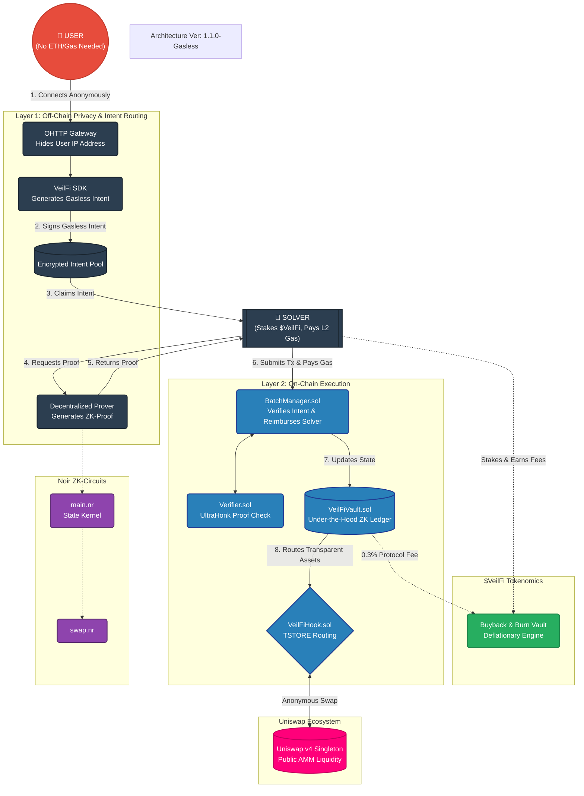

```mermaid
graph TB
    %% --- STYLING DEFINITIONS ---
    classDef user fill:#e74c3c,stroke:#c0392b,stroke-width:2px,color:#fff,rx:10px,ry:10px;
    classDef offchain fill:#2c3e50,stroke:#1a252f,stroke-width:2px,color:#fff,rx:5px,ry:5px;
    classDef contract fill:#2980b9,stroke:#1f3a93,stroke-width:2px,color:#fff,rx:5px,ry:5px;
    classDef zk fill:#8e44ad,stroke:#5b2c6f,stroke-width:2px,color:#fff,rx:5px,ry:5px;
    classDef uni fill:#ff007a,stroke:#c2005d,stroke-width:2px,color:#fff,rx:5px,ry:5px;
    classDef eco fill:#27ae60,stroke:#1e8449,stroke-width:2px,color:#fff,rx:5px,ry:5px;

    %% --- ACTORS ---
    User(("👤 USER<br>(No ETH/Gas Needed)")):::user
    Solver[["🤖 SOLVER<br>(Stakes $VeilFi, Pays L2 Gas)"]]:::offchain

    %% --- LAYER 1: OFF-CHAIN (PRIVACY & INTENTS) ---
    subgraph Layer_OffChain[Layer 1: Off-Chain Privacy & Intent Routing]
        direction TB
        OHTTP[OHTTP Gateway<br>Hides User IP Address]:::offchain
        SDK[VeilFi SDK<br>Generates Gasless Intent]:::offchain
        Pool[(Encrypted Intent Pool)]:::offchain
        Prover[Decentralized Prover<br>Generates ZK-Proof]:::offchain
    end

    %% --- LAYER 2: ON-CHAIN (SMART CONTRACTS) ---
    subgraph Layer_OnChain[Layer 2: On-Chain Execution]
        direction TB
        Batcher[BatchManager.sol<br>Verifies Intent & Reimburses Solver]:::contract
        Verifier[Verifier.sol<br>UltraHonk Proof Check]:::contract
        Vault[(VeilFiVault.sol<br>Under-the-Hood ZK Ledger)]:::contract
        Hook{VeilFiHook.sol<br>TSTORE Routing}:::contract
    end

    %% --- ZK CIRCUITS ---
    subgraph Layer_ZK [Noir ZK-Circuits]
        direction LR
        Kernel[main.nr<br>State Kernel]:::zk
        AppSwap[swap.nr]:::zk
    end

    %% --- UNISWAP V4 ---
    subgraph Layer_Uni [Uniswap Ecosystem]
        Singleton[(Uniswap v4 Singleton<br>Public AMM Liquidity)]:::uni
    end

    %% --- TOKEN ECONOMICS ---
    subgraph Layer_Eco [$VeilFi Tokenomics]
        Burn[Buyback & Burn Vault<br>Deflationary Engine]:::eco
    end

    %% --- THE TRANSACTION FLOW ---
    
    %% 1. User signs intent
    User -- "1. Connects Anonymously" --> OHTTP
    OHTTP --> SDK
    SDK -- "2. Signs Gasless Intent" --> Pool
    
    %% 2. Solver picks it up
    Pool -- "3. Claims Intent" --> Solver
    Solver -- "4. Requests Proof" --> Prover
    Prover -.-> Kernel
    Kernel -.-> AppSwap
    Prover -- "5. Returns Proof" --> Solver

    %% 3. Blockchain Execution
    Solver -- "6. Submits Tx & Pays Gas" --> Batcher
    Batcher <--> Verifier
    Batcher -- "7. Updates State" --> Vault
    
    %% 4. Swap Execution
    Vault -- "8. Routes Transparent Assets" --> Hook
    Hook <--> |"Anonymous Swap"| Singleton
    
    %% 5. Economics
    Vault -.-> |"0.3% Protocol Fee"| Burn
    Solver -.-> |"Stakes & Earns Fees"| Burn

    %% Note
    Note[Architecture Ver: 1.1.0-Gasless]
```
